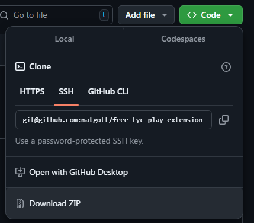
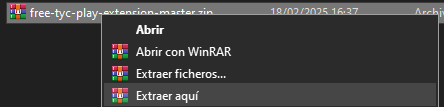
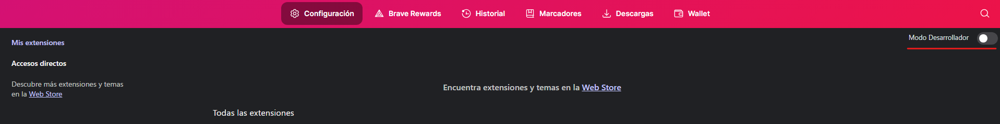
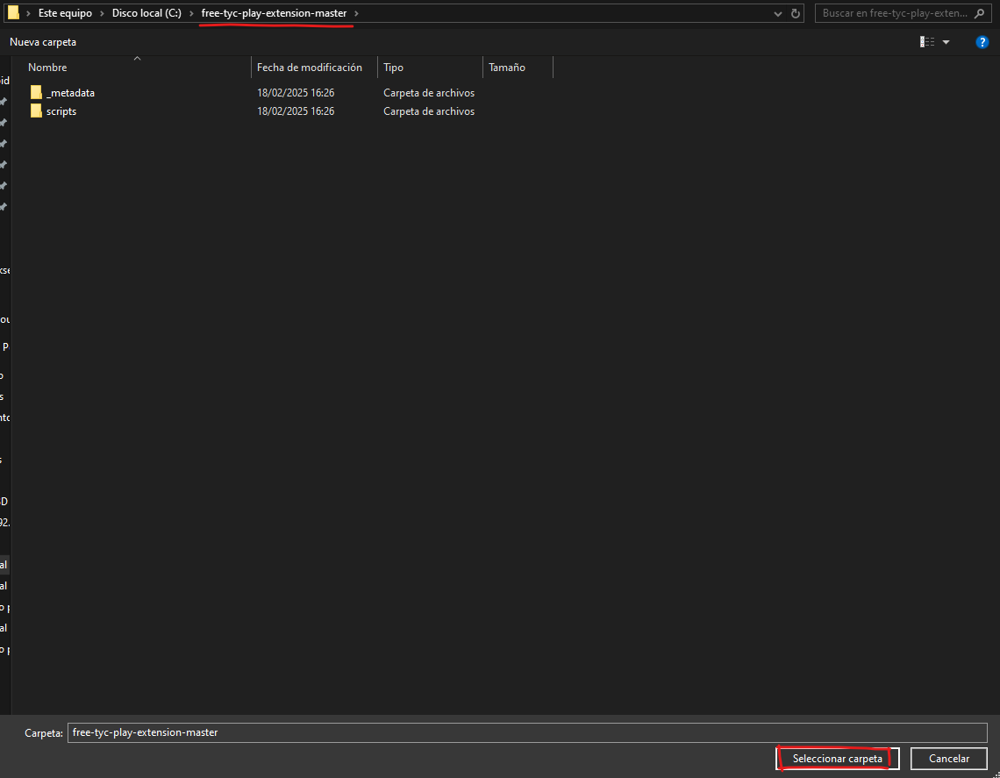
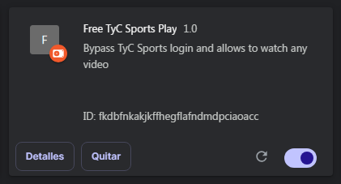

# Free TyC Sports Play Extension
Con esta extensión se puede "ignorar" la necesidad de tener un usuario de Flow/DirectTV/etc para poder ver [TyC Sports Play](https://play.tycsports.com)

## Descarga
Descarga la extensión haciendo click en `Code<>` y luego en `Download ZIP`:

## Instalación
Una vez descargada la extensión como ZIP, extrae los archivos en una carpeta (esta carpeta no la debes borrar ya que contiene el código de la extensión) haciendo Click Derecho en el archivo ZIP y luego `Extraer aquí`:

Luego abrir Chrome/Brave/Edge (el navegador basado en Chromium que uses) y abrir en la barra de url `chrome://extensions`
Activar el modo desarrollador:

Ya activado el modo desarrollador, clickear `Cargar Descomprimida` e ingresar a la carpeta de la extensión y tocar `Seleccionar Carpeta`:

Listo, ya debería quedar instalada y solo queda entrar a [TyC Sports Play](https://play.tycsports.com) y ver cualquier video o transmisión en vivo:

